<h1 align="center">

</h1>

## About The Project

This project was created as part of a school assignment, with the goal of developing a fictional website that simulates the reservation management for a bed and breakfast. The aim is to provide users with a realistic experience of interacting with a booking platform, complete with all the necessary features to manage a hospitality business.

<br />
<p align="center">
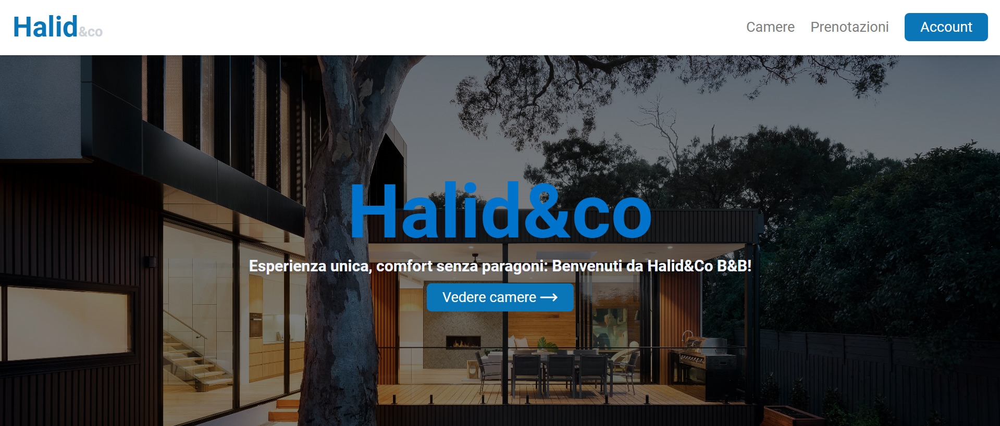
&nbsp;
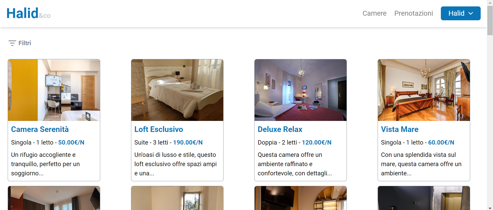
</p>

<p align="center">
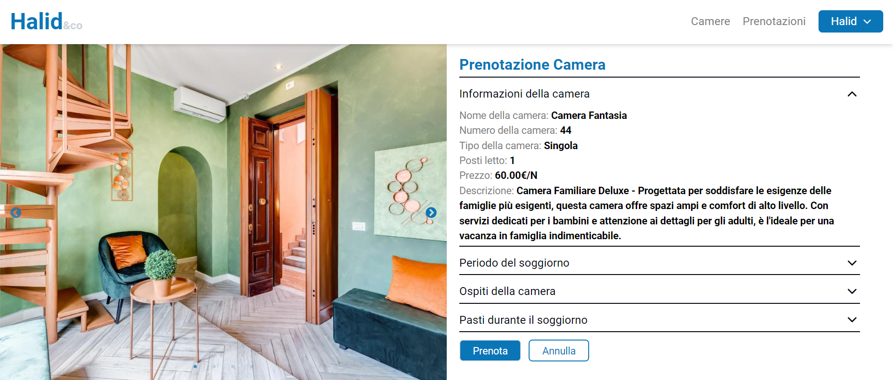
&nbsp;

</p>

## Features

<details close>
<summary>
User registration and login
</summary> 
<br />
  
The website features a system for managing user login and registration designed to ensure the security and integrity of user data. This system performs thorough checks on the data entered by users to ensure compliance with the required standards.

For registration, users must provide personal information, including their first name, last name, date of birth, phone number, and password. Once entered, these details are subjected to a series of validity checks. For instance, the system verifies that the phone number is in the correct format, the date of birth is plausible, and the password meets complexity requirements to ensure account security.

During the login process, users need to enter their first name, last name, and password. These details are cross-referenced with the data stored in the database to verify the user's authenticity. If the data matches, the user is authenticated and granted access to their account. If not, the system notifies the user that the credentials are incorrect and prompts them to try again.

<p align="center">
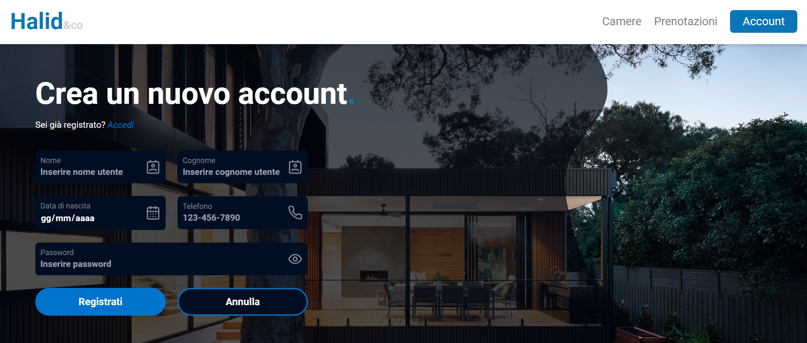
</p>
</details>

<details close>
<summary>
Room filters
</summary> 
<br />

The website features a filtering functionality to streamline the search and selection of rooms. Users can apply various criteria to view only the options that meet their specific needs.

Users can filter rooms by the desired type, which can be single, double, or suite. This allows users to narrow down their search to options that best fit their personal preferences and requirements. Additionally, users can select the number of beds needed to ensure the room accommodates the expected number of guests.

The price filter enables users to set a spending range, helping them find rooms within their budget. This criterion is particularly useful for comparing available options and making an informed financial decision.

Lastly, users can specify the booking period to view only the rooms available for their desired dates. This filter ensures that only options that are actually available for the requested stay are displayed, avoiding wasted time on rooms that are already booked.

By combining these filters, users can quickly and efficiently find the ideal room for their stay, saving time and enhancing the efficiency of their travel planning.

<p align="center">
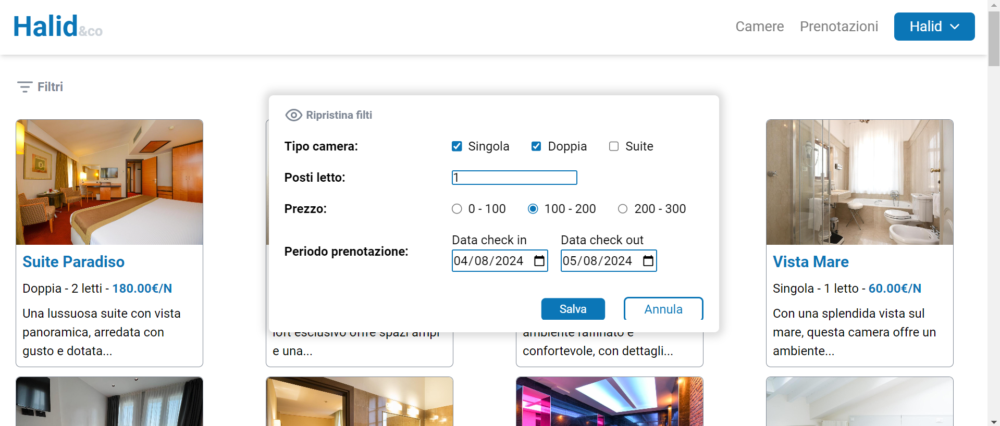
</p>
</details>


<details close>
<summary>
Room Booking Management
</summary> 
<br />
  
The website features a room booking system designed to provide a simple and secure user experience. During the booking process, users must select their stay dates, the number of guests, and, if desired, the meals for their stay. Additional guests and meals are optional, allowing for greater flexibility in planning the stay.

Once these details are entered, the system performs a series of thorough checks before confirming the booking. First, the system verifies the room's availability for the selected period to ensure that it is not already occupied or unavailable.

In addition to availability, the system checks other parameters such as the room's capacity in relation to the number of guests and the compatibility of the chosen meals with the bed and breakfast's offerings. These checks ensure that all user needs are met and that the booking can be completed smoothly.

After successfully passing all checks, users can confirm their booking. Once confirmed, users can access a dedicated page that displays all their bookings, both upcoming and past. On this page, users also have the ability to cancel future bookings, providing an additional level of flexibility and control.

<p align="center">
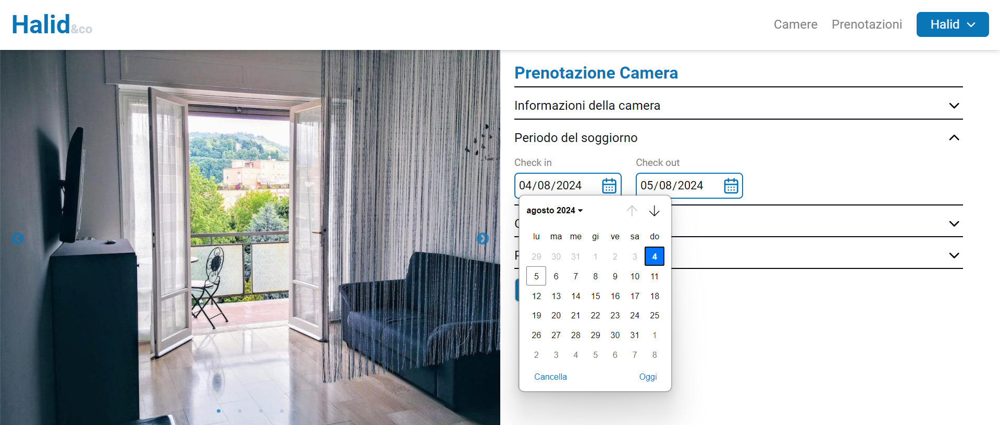
&nbsp;
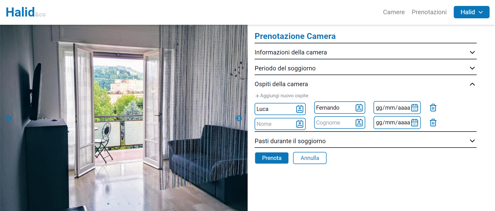
</p>

<p align="center">
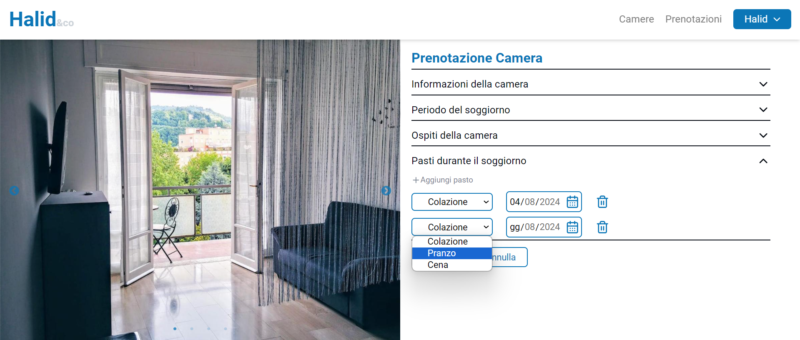
&nbsp;
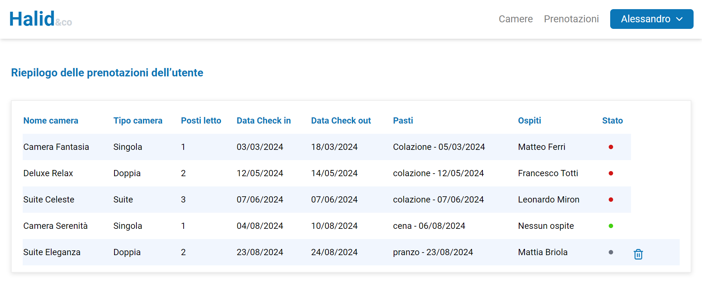
</p>
</details>

<details close>
<summary>
User Profile Management
</summary> 
<br />

The user settings page provides a comprehensive interface for managing personal information and bookings. In this section, users have the ability to view and edit their personal details, such as name, email address, phone number, and other relevant information. This feature allows users to keep their information up-to-date and accurate, facilitating communication and profile management.

In addition to updating personal information, the settings page includes a direct link to the bookings page. By clicking this link, users can quickly access an overview of all their bookings, both upcoming and past. This summary helps users keep track of their scheduled stays and completed reservations.

Furthermore, there is a dedicated section that displays all the guests registered by the user in their various bookings. This allows users to view and manage guest information associated with their reservations, making it easier to plan and modify bookings based on guest needs.

<p align="center">
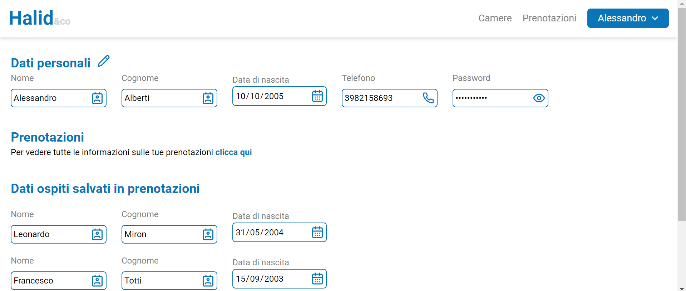
</p>
</details>

<details close>
<summary>
Administrator Settings Page
</summary> 
<br />

The Administrator Settings page provides a comprehensive overview for managing the profile and administrative tasks of the site. Within this page, the administrator can view and update their personal information, ensuring that details are always current and accurate.

One of the main sections on this page includes a direct link to view all bookings made by users. This link redirects the administrator to a page where they can see the status of all reservations and, if necessary, cancel specific bookings. This tool is essential for effectively managing and supervising user bookings.

The Administrator Settings page is divided into several sections for efficient management. The "View Rooms" section allows the administrator to see all the rooms available on the site, providing an overview of the accommodation options. In the "View Users" section, the administrator can access details of all registered users, enabling centralized management of user accounts and information.

Another important section is the one for adding new rooms. Here, the administrator can input all necessary details to add a new room to the site, thus expanding the options available to users.

Finally, the primary section of the settings page is the administrative dashboard. This dashboard provides crucial data such as the total number of registered users, the number of rooms booked, and total earnings. Additionally, it includes a chart displaying monthly earnings, offering a clear and immediate view of the site’s financial and operational performance.

<p align="center">
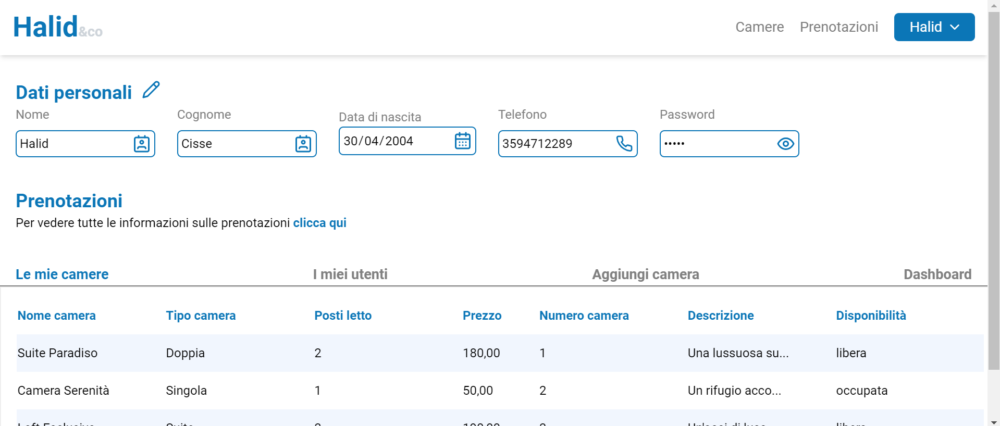
&nbsp;
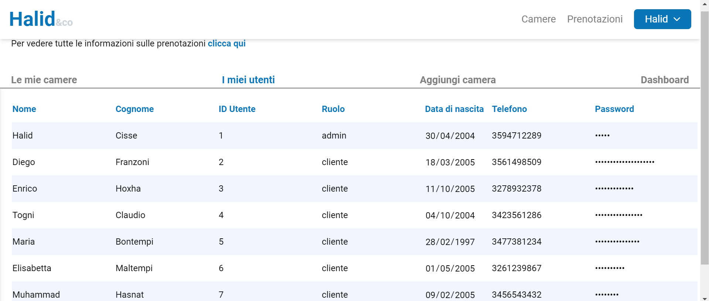
</p>

<p align="center">
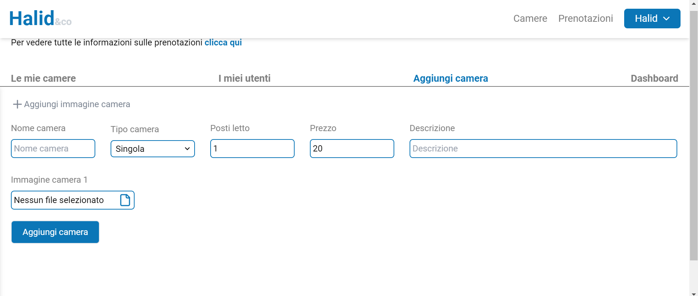
&nbsp;
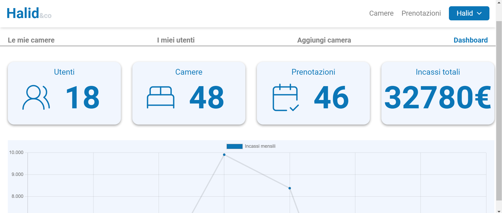
</p>
</details>

## Getting Started

To get a local copy up and running follow these simple steps.

### Prerequisites

<p>Before you start, make sure you have the following prerequisites installed:</p>
<ul>
<li>A code editor to run the project (e.g., Visual Studio Code)</li>
<li>Git</li>
<li> Node.js </li>
<li> XAMPP, or MAMP for macOS users</li>
</ul>

### Installation

For the project to function correctly, the backend steps must be completed before proceeding with the frontend steps.

<details close>
<summary>
Backend
</summary> 
<br />
Before running the project, you will need to upload the database to ensure the correct data is available by following these steps.

#### Step 1: Accessing PHPMyAdmin

1. Open your web browser and navigate to your PHPMyAdmin dashboard. This is typically accessible through your local server's address (e.g., `http://localhost/phpmyadmin`).

#### Step 2: Creating the Database

2. Once logged in to PHPMyAdmin, click on the "Databases" tab in the top navigation menu.

3. In the "Create database" field, enter the name "halid_and_co".

4. Click on the "Create" button to create the database (halid_and_co).

#### Step 3: Importing the SQL File

5. Locate the `halid_and_co.sql` file in the root folder of your project directory, in this case [here](backend/halid_and_co.sql).

6. Back in PHPMyAdmin, select the "halid_and_co.sql" database from the left-hand sidebar to ensure it is the active database.

7. Look for the "Import" tab in the top navigation menu.

8. Click on the "Choose file" button, then select the `halid_and_co.sql` file from your computer.

9. Once the file is selected, click on the "Go" or "Import" button to begin importing the SQL file into the database.

#### Step 4: Verifying the Import

10. PHPMyAdmin will display a confirmation message once the import is complete. You should see a list of tables imported from the `halid_and_co.sql.sql` file.

</details>

<details close>
<summary>
Fontend
</summary> <br />
1. To download the project, you can clone the repository using the following command in your terminal:
  
```shell
git clone https://github.com/Halid04/progetto-fullstack-informatica-quinta.git
```
Alternatively, you can download the ZIP file of [the repository from GitHub](https://github.com/Halid04/progetto-fullstack-informatica-quinta) and extract it to your computer. <br /> <br />
2. After downloading the project, navigate to the project directory via the terminal and install all necessary dependencies by running the following command:
```shell
npm install
```
<br />
3. Once the dependencies are installed, you can start the application by running:

```shell
npm run dev
```
The application will then be available at http://localhost:5173 or http://localhost:5173/progetto-fullstack-informatica-quinta.

</details>

## Built With

* [![React][React.js-badge]][React-url]
* [![PrimeReact][PrimeReact-badge]][PrimeReact-url]
* [![PHP][PHP-badge]][PHP-url]
* [![MySQL][MySQL-badge]][MySQL-url]
* [![Tailwind CSS][TailwindCSS-badge]][TailwindCSS-url]
* [![Lucide.dev][Lucide.dev-badge]][Lucide.dev-url]
* [![Chart.js][Chart.js-badge]][Chart.js-url]

[React.js-badge]: https://img.shields.io/badge/React-61DAFB?style=flat&logo=react&logoColor=black
[PrimeReact-badge]: https://img.shields.io/badge/PrimeReact-007AD9?style=flat&logo=primereact&logoColor=white
[PHP-badge]: https://img.shields.io/badge/PHP-777BB4?style=flat&logo=php&logoColor=white
[MySQL-badge]: https://img.shields.io/badge/MySQL-00618A?style=flat&logo=mysql&logoColor=white
[TailwindCSS-badge]: https://img.shields.io/badge/Tailwind_CSS-06B6D4?style=flat&logo=tailwindcss&logoColor=white
[Lucide.dev-badge]: https://img.shields.io/badge/Lucide.dev-000000?style=flat&logo=lucide&logoColor=white
[Chart.js-badge]: https://img.shields.io/badge/Chart.js-F5F5F5?style=flat&logo=chart.js&logoColor=000000

[React-url]: https://reactjs.org/
[PrimeReact-url]: https://www.primefaces.org/primereact/
[PHP-url]: https://www.php.net/
[MySQL-url]: https://www.mysql.com/
[TailwindCSS-url]: https://tailwindcss.com/
[Lucide.dev-url]: https://lucide.dev/
[Chart.js-url]: https://www.chartjs.org/

## Contributors

[//]: contributor-faces
<a href="https://github.com/Halid04"></a>
